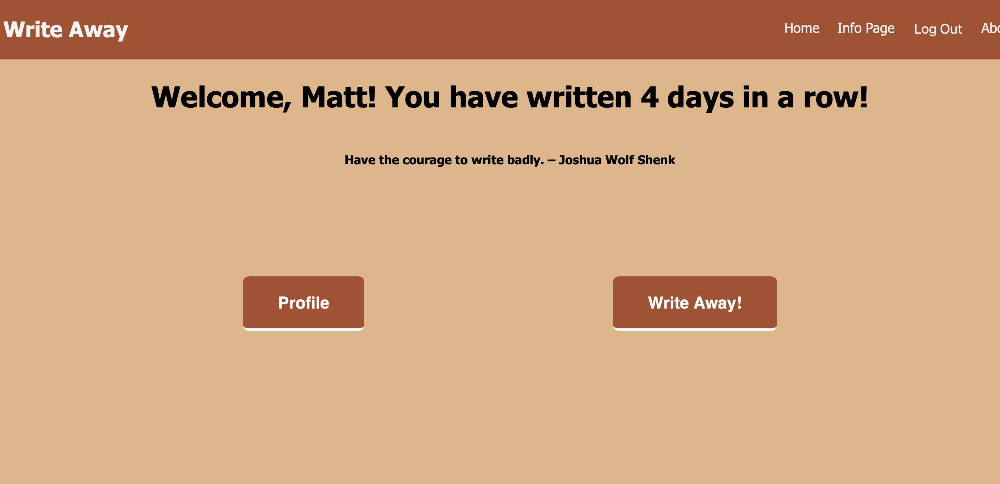
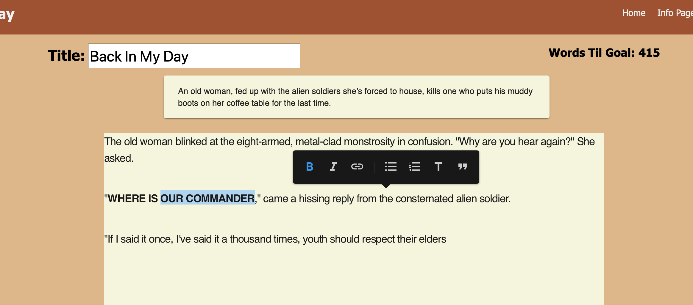
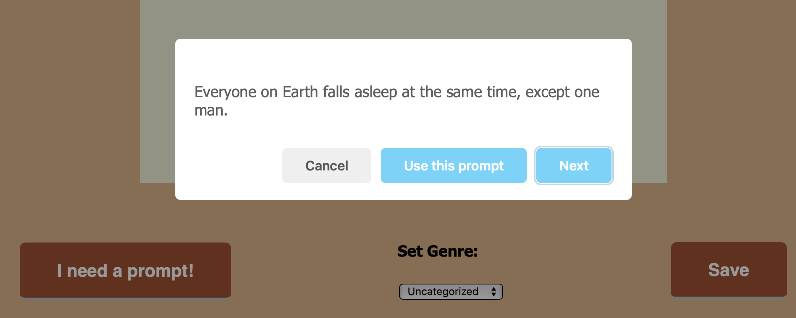
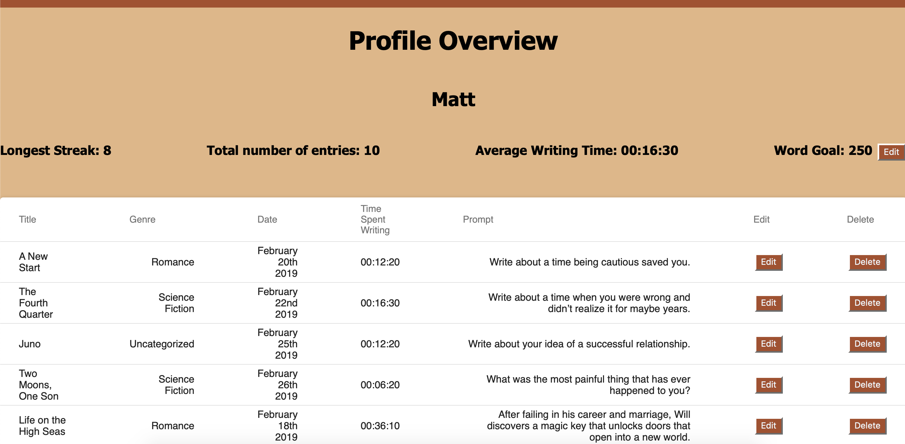
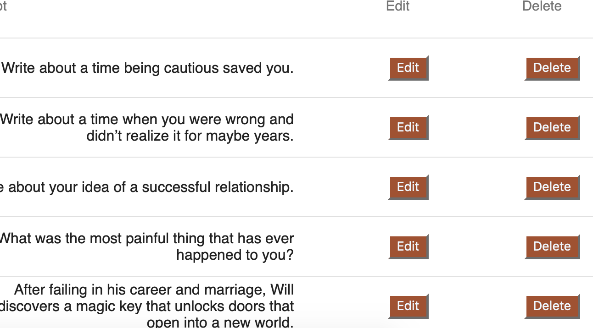

# WriteAway

WriteAway is a creative writing app. It features a text editor that will allow you to build a library of your collected writings, and analyze your progress through time.

The most common piece of advice from professional writers to amateurs is this: if you want to get better you need to write every day. Through prompts, positive affirmations, and advice, WriteAway facilitates users to pursue this endeavor.

## Getting Started

### Prerequisites

- Node.js
- Postico
- Terminal

### Installing

- Fork or clone project
- `npm install`
- `createdb prime_app`
- `npm run server`
- `npm run client`

## Features

### Homepage

### Text Editor

### Prompts

### Profile

### Library

## Built With

React.js

MegaDraft

Material UI

Moment

## Author

Matt Kleven

## Acknowledgments

Chris Black and everyone in Zaurak